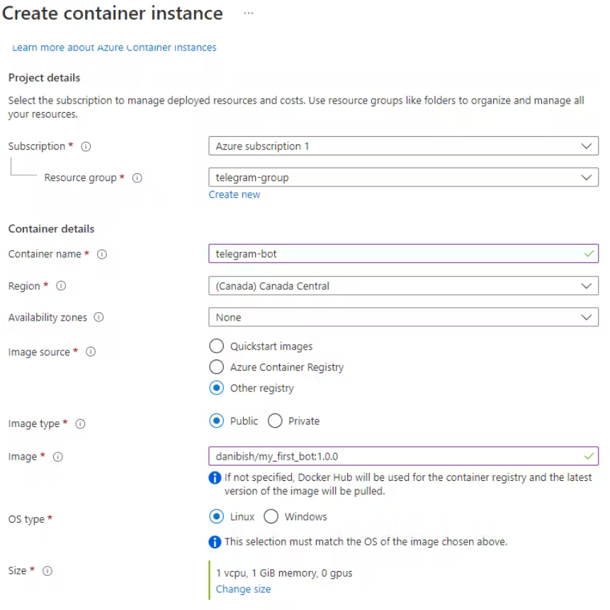
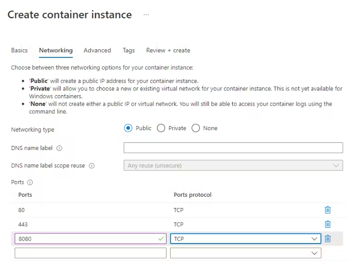
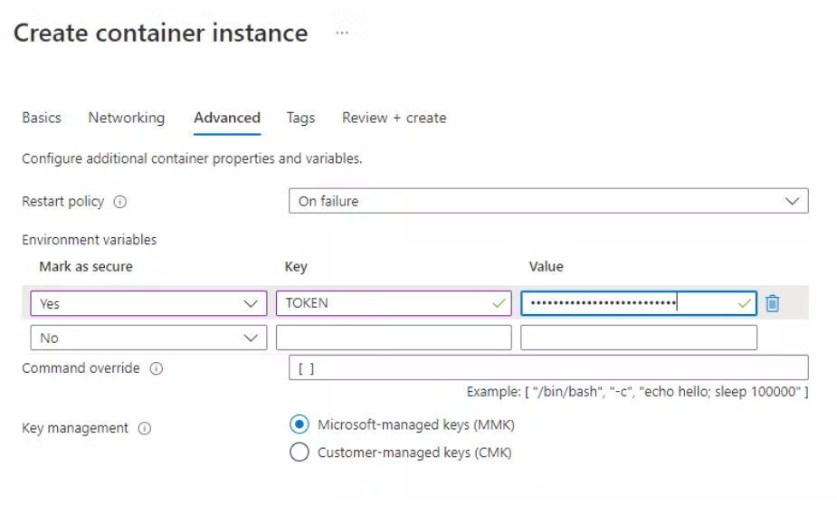
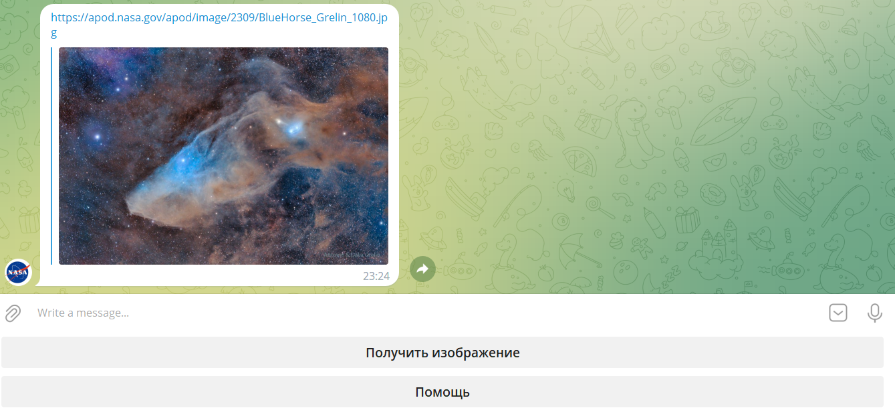

## Пишем Telegram бота на Java для получения картинки от NASA

### Что нужно сделать

1. Получить ключ для API NASA по адресу: https://api.nasa.gov/ <br>
2. Сделать запрос из кода: https://api.nasa.gov/planetary/apod?api_key=ВАШ_КЛЮЧ <br>
3. Создать класс ответа и разобрать json-ответ с помощью Jackson или Gson <br>
4. Найти поле url в ответе и скачать массив byte, который сохранить в файл <br>
5. Имя файла должно быть взято из части url
6. Зарегистрировать бота в приложении Telegram
7. Получить ключ для нашего бота
8. Получить наш chatID
9. Подключить зависимость Telegram API к нашему проекту
10. Написать бота
11. Задеплоить его в Azure

### Описание

Нужно воспользоваться публичным API NASA и скачать ежедневно выгружаемое им изображение. Несмотря на то, что API публичный, доступ к нему предоставляется по ключу, который достаточно просто получить по адресу: https://api.nasa.gov/. Перейдя по ссылке, заполняем личными данными поля:
* First Name
* Last Name
* Email

В ответ (а так же на почтовый адрес) будет выслан ключ. С этим ключом нужно делать запросы к API.

Итак, чтобы получить ссылку на картинку или другой контент, нужно:

1. Сделать запрос по адресу: https://api.nasa.gov/planetary/apod?api_key=ВАШ_КЛЮЧ
2. Разобрать полученный ответ
3. В ответе найти поле `url` - оно содержит адрес на изображение, которое нужно скачать и сохранить локально (на своем компьютере), имя сохраняемого файла нужно взять из части url (из примера ниже DSC1028_PetersNEOWISEAuroralSpike_800.jpg)
4. Проверить что сохраненный файл открывается.

Пример ответа сервиса NASA

```json
{
  "copyright": "Bill Peters",
  "date": "2020-07-17",
  "explanation": "After local midnight on July 14 comet NEOWISE was still above the horizon for Goldenrod, Alberta, Canada, just north of Calgary, planet Earth. In this snapshot it makes for an awesome night with dancing displays of the northern lights. The long-tailed comet and auroral displays are beautiful apparitions in the north these days. Both show the influence of spaceweather and the wind from the Sun. Skygazers have widely welcomed the visitor from the Oort cloud, though C/2020 F3 (NEOWISE) is in an orbit that is now taking it out of the inner Solar System.  Comet NEOWISE Images: July 16 | July 15 | July 14 | July 13 | July 12 | July 11 | July 10 & earlier",
  "hdurl": "https://apod.nasa.gov/apod/image/2007/DSC1028_PetersNEOWISEAuroralSpike.jpg",
  "media_type": "image",
  "service_version": "v1",
  "title": "NEOWISE of the North",
  "url": "https://apod.nasa.gov/apod/image/2007/DSC1028_PetersNEOWISEAuroralSpike_800.jpg"
}
```

### Реализация

#### Написание бота

1. Создайте проект `maven` или `gradle` и добавьте в pom.xml или gradle.build библиотеку apache httpclient

Пример:

```xml
<dependency>
   <groupId>org.apache.httpcomponents</groupId>
   <artifactId>httpclient</artifactId>
   <version>4.5.12</version>
</dependency>
```

2. Создайте метод в который добавьте и настройте класс `CloseableHttpClient` например с помощью builder

```cs
CloseableHttpClient httpClient = HttpClientBuilder.create()
    .setDefaultRequestConfig(RequestConfig.custom()
        .setConnectTimeout(5000)    // максимальное время ожидание подключения к серверу
        .setSocketTimeout(30000)    // максимальное время ожидания получения данных
        .setRedirectsEnabled(false) // возможность следовать редиректу в ответе
        .build())
    .build();
```

3. Добавьте объект запроса HttpGet request = new HttpGet("https://api.nasa.gov/planetary/apod?api_key=ВАШ_КЛЮЧ") и вызовите удаленный сервис `CloseableHttpResponse response = httpClient.execute(request)`;<br>
4. Добавьте в pom.xml или gradle.build библиотеку для работы с json

Пример:

```xml
<dependency>
   <groupId>com.fasterxml.jackson.core</groupId>
   <artifactId>jackson-databind</artifactId>
   <version>2.11.1</version>
</dependency>
```

5. Создайте класс, в который будем преобразовывать json ответ от сервера
6. Преобразуйте json в java-объект
7. В java-объекте найдите поле url и сделайте с ним еще один http-запрос с помощью уже созданного httpClient
8. Сохраните тело ответа в файл с именем части url
9. Проверьте, что файл скачивается и открывается

#### Регистрация в Telegram

10. Зарегистрируйте бота в Telegram (@BotFather) и получите токен

11. Протестируйте бот локально
```bash
docker build -t nasa1 .
docker run --env TOKEN=ваш_токен --env USERNAME=ваш_бот --env NASA_KEY=ваш_ключ --rm nasa1
```

#### Деплой в Azure

Хороший туториал можно найти [здесь](https://blog.danielabg.com/how-to-create-a-telegram-bot-using-docker-and-host-it-on-azure#heading-step-6-deploy-your-docker-app-in-azure-container-instances-service).

12. Сбилдите и запуште образ в ваш docker hub.
```bash
docker login
docker build -t ваш_пользователь/nasa1:1.0.0 .
docker image push ваш_пользователь/nasa1:1.0.0
```

<details>
  <summary>Подробное описание деплоя в Azure</summary>

- Resource group: Create new -> choose a name for the workspace where your container app will live, for example "container_group"
- Container name: Choose a name for your app, for example "mybot"
- Region: Choose the region closest to you, but avoid us-east-1 because sometimes it's very full. Example: Canada central.
- Availability zones: none
- Image source: Other registry
- Image type: Public
- Image: Here you will type your dockerhub username, image name and tag as we wrote it when we did the push command in step 5. Example: danibish/my_first_bot:1.0.0
- Os type: Linux
- Size: Select change size to use only 1 GiB of memory, and then click "ok"



- Now, we move on to the Networking Page
- Add the port 443.
 


This is the place where you will write the API Token value, and nowhere else.

Mark it as secure, type the word TOKEN in upper case, and copy-paste your API token



</details>

Готово!


